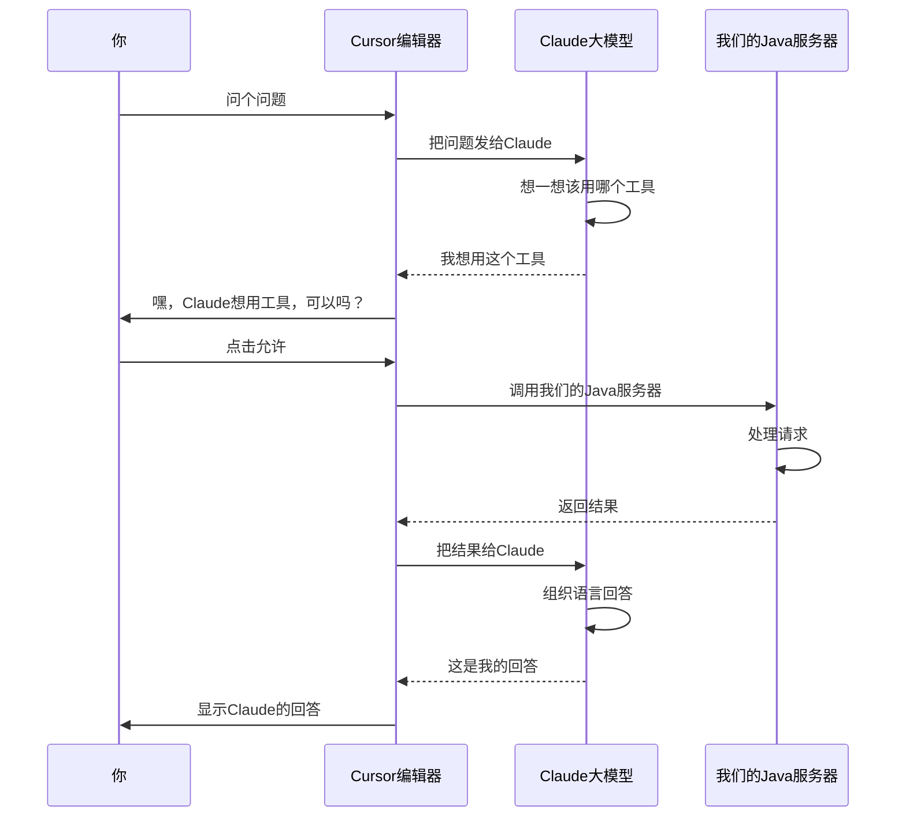
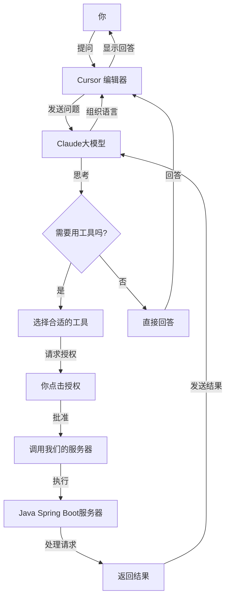

# 手把手教你用 Java 和 Spring Boot 搭建 MCP 服务器并在 Cursor 中玩转工具调用

## 开篇闲聊

嘿，最近听说过 [Model Context Protocol (MCP)](https://modelcontextprotocol.io/) 吗？这是一个让大语言模型（比如 Claude）能够调用外部工具的开放协议。说白了，就是让 AI 能够"伸出手"去操作我们定义的各种功能。今天我就跟大家分享一下，怎么用 Java 和 Spring Boot 自己动手搭一个 MCP 服务器，然后在 Cursor 编辑器里把玩起来。

## MCP 是啥？简单聊聊

MCP 服务器基本上能提供三种能力：

1. **资源（Resources）**：就是一些文件数据，客户端可以读取，比如 API 返回的结果或者文件内容
2. **工具（Tools）**：这个最常用，就是一些函数，AI 可以调用它们（当然得经过你同意）
3. **提示（Prompts）**：一些预设的模板，帮助用户完成特定任务

今天我们主要玩的就是第二种：工具（Tools）。

## 技术栈和版本

咱们需要准备这些技术：

- **Java**: JDK 21（没错，用新版的）
- **Spring Boot**: 3.3.12
- **Spring AI**: `spring-ai-starter-mcp-server-webflux`（这是专门用来做 MCP 服务器的）
- **构建工具**: Maven（老朋友了）
- **通信方式**: SSE (Server-Sent Events)（就是服务器向客户端推送数据的一种方式）

## 项目长啥样

```
mcp-server-demo
  ├── src/main/java/com/example/mcpserver
  │   ├── McpServerApplication.java        # 主程序入口
  │   └── tools/                           # 工具实现
  │       ├── WeatherTool.java             # 天气工具
  │       └── SimpleTool.java              # 简单工具
  ├── src/main/resources
  │   └── application.yml                  # 配置文件
  └── pom.xml                              # Maven 配置
```

## 步骤 1：先把 Spring Boot 项目搭起来

首先，咱们得创建一个 Spring Boot 项目，把需要的依赖都加上。

### Maven 配置 (pom.xml)

```xml
<parent>
    <groupId>org.springframework.boot</groupId>
    <artifactId>spring-boot-starter-parent</artifactId>
    <version>3.3.12</version>
    <relativePath/>
</parent>

<properties>
<java.version>21</java.version>
<spring-ai.version>1.0.0</spring-ai.version>
<spring-cloud-nacos.version>2023.0.3.3</spring-cloud-nacos.version>
<spring-cloud-starter.version>4.3.0</spring-cloud-starter.version>
</properties>

<dependencyManagement>
<dependencies>
    <dependency>
        <groupId>io.modelcontextprotocol.sdk</groupId>
        <artifactId>mcp-bom</artifactId>
        <version>0.10.0</version>
        <type>pom</type>
        <scope>import</scope>
    </dependency>
</dependencies>
</dependencyManagement>

<dependencies>

<!-- Spring Boot Starter -->
<dependency>
    <groupId>org.springframework.boot</groupId>
    <artifactId>spring-boot-starter</artifactId>
</dependency>

<!-- Spring AI 核心依赖，用来构建 MCP Server -->
<dependency>
    <groupId>org.springframework.ai</groupId>
    <artifactId>spring-ai-starter-mcp-server-webflux</artifactId>
    <version>${spring-ai.version}</version>
</dependency>

<!-- 也可以用这个 Spring Boot Web Starter for SSE -->
<!--        <dependency>-->
<!--            <groupId>org.springframework.ai</groupId>-->
<!--            <artifactId>spring-ai-starter-mcp-server-webmvc</artifactId>-->
<!--            <version>${spring-ai.version}</version>-->
<!--        </dependency>-->

</dependencies>

```

## 步骤 2：创建主程序入口

就是普通的 Spring Boot 应用入口，没啥特别的。

## 步骤 3：开始写好玩的工具

在 MCP 中，工具就是我们提供给 AI 使用的功能。咱们写两种工具：一个简单的，一个查天气的。

### 简单工具实现

```java
package com.example.mcpserver.tools;

import org.springframework.ai.mcp.server.annotation.McpTool;
import org.springframework.ai.mcp.server.annotation.McpToolParam;
import org.springframework.stereotype.Component;

import java.time.Instant;

@Component
public class SimpleTool {

    @McpTool(name = "echoTool", description = "回声工具，返回输入的消息")
    public String echo(@McpToolParam(name = "message", description = "要回显的消息") String message) {
        return "Echo: " + message;
    }

    @McpTool(name = "simpleMathTool", description = "计算两个数字的和")
    public int add(
            @McpToolParam(name = "a", description = "第一个数字") int a,
            @McpToolParam(name = "b", description = "第二个数字") int b) {
        return a + b;
    }

    @McpTool(name = "timestampTool", description = "返回当前时间")
    public String timestamp() {
        return Instant.now().toString();
    }
}
```

看，超简单吧？就是普通的 Java 方法，加上 `@McpTool` 注解，参数上加 `@McpToolParam` 注解，就能被 AI 调用了。

### 天气工具实现

```java
package com.example.mcpserver.tools;

import org.springframework.ai.mcp.server.annotation.McpTool;
import org.springframework.ai.mcp.server.annotation.McpToolParam;
import org.springframework.stereotype.Component;
import org.springframework.web.client.RestTemplate;

import java.util.Map;

@Component
public class WeatherTool {

    private final RestTemplate restTemplate = new RestTemplate();
    private static final String NWS_API_BASE = "https://api.weather.gov";

    @McpTool(name = "getWeatherForecastByLocation", description = "获取指定经纬度的天气预报")
    public String getWeatherForecast(
            @McpToolParam(name = "latitude", description = "纬度") double latitude,
            @McpToolParam(name = "longitude", description = "经度") double longitude) {
        // 查询天气
    }

    @McpTool(name = "getAlerts", description = "获取指定州的天气警报")
    public String getAlerts(@McpToolParam(name = "state", description = "美国州代码，例如 CA, NY") String state) {
        // 查询报警
    }
}
```

这个稍微复杂点，但也就是调用了美国国家气象局的 API，然后把结果整理成易读的格式返回。

## 步骤 4：配置一下应用

在 `application.yml` 中简单配置一下 MCP 服务器：

```yaml
spring:
  application:
    name: mcp-server-demo
  profiles:
    active: test
  ai:
    mcp:
      server:
        name: mcp-server-demo
        request-timeout: 30s
```

## 步骤 5：启动应用

```bash
mvn clean package spring-boot:run
```

> 全部源码在：https://github.com/oneinstepGO/mcp-server-demo.git

---

## MCP 是怎么工作的？

来看看 MCP 的工作流程，其实很简单：



## 在 Cursor 中试试我们的服务器

### 步骤 1：启动服务器

### 步骤 2：配置 Cursor

在某个项目根目录下创建 `.cursor/mcp.json` 文件，添加如下内容：

```json
{
  "mcpServers": {
    "mcp-server-demo": {
      "url": "http://localhost:8080/sse"
    }
  }
}
```


就这么简单，告诉 Cursor 我们的服务器在哪里。


### 步骤 3：在 Cursor 里玩起来

1. 打开 Cursor 编辑器，打开设置，找到 MCP 相关配置
2. 这是应该可以看到我们的 `Mcp Server`，打开开关，应该就可以看到我们编写的 `Mcp Server` 提供的几个工具。
3. 在 Cursor 中进行聊天 ，让它使用我们的工具

试试这些问题：

- "现在几点了？"（Cursor 会用 `timestampTool`）
- "5 加 7 等于多少？"（Cursor 会用 `simpleMathTool`）
- "纽约州有什么天气警报吗？"（Cursor 会用 `getAlerts` 工具）
- "旧金山现在天气怎么样？"（Cursor 会用 `getWeatherForecastByLocation` 工具）


如上图所示，出现了 `Call MCP Tool`，并且调用了我们的工具，例如调用 `getWeatherForecastByLocation` ，并且输出了美国某个州的天气，就说明我们搭建的 `Mcp Server` 成功了。

## 整个过程是怎么连起来的？



## 题外话

除了 `Cursor` 和 `Trae`，也可以用官方提供的 `inspector` 网页工具调试 MCP。
GitHub地址：https://github.com/modelcontextprotocol/inspector


## 总结一下

今天我们从零开始，用 Java 和 Spring Boot 搭建了一个 MCP 服务器，实现了几个简单但有用的工具，并在 Cursor 中成功调用。MCP 真的很酷，它让 AI 能够"走出来"，与我们的系统交互，执行各种任务。

随着这个技术的发展，肯定会有更多有趣的应用场景。希望这篇文章能帮你入门 MCP 开发，开始探索 AI 与外部工具结合的无限可能！

## 参考资料

- [MCP Java 官方文档](https://modelcontextprotocol.io/quickstart/server#java)
- [Spring AI MCP 服务器文档](https://docs.spring.io/spring-ai/reference/api/mcp/mcp-server-boot-starter-docs.html)
