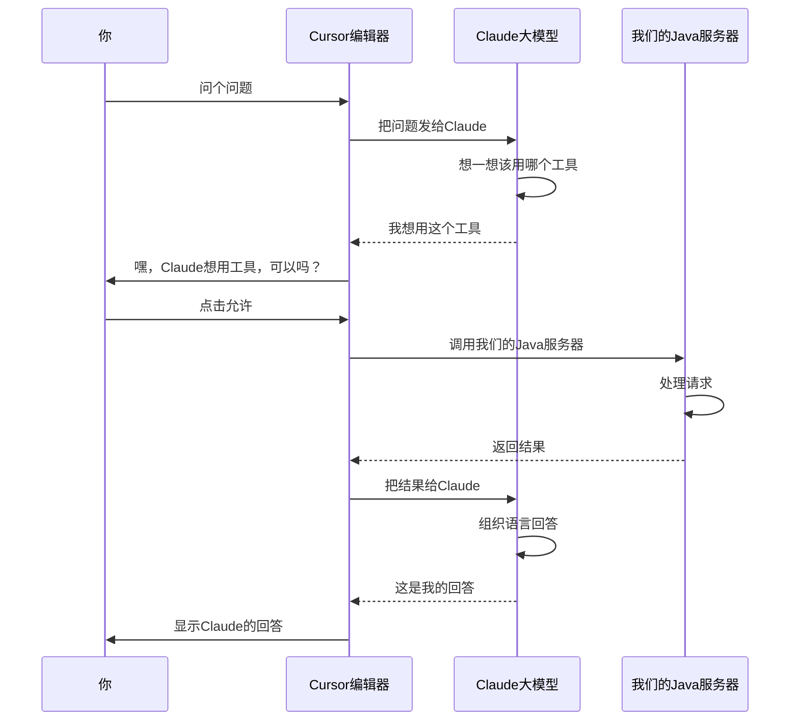
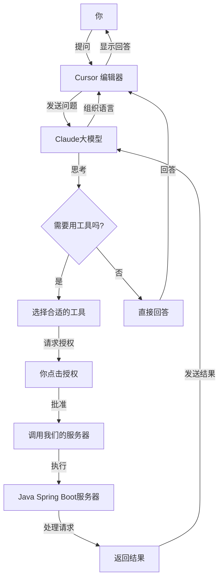

# 手把手教你用 Java 和 Spring Boot 搭建 MCP 服务器并在 Cursor 中玩转工具调用

## 开篇闲聊

嘿，最近听说过 [Model Context Protocol (MCP)](https://modelcontextprotocol.io/) 吗？这是一个让大语言模型（比如 Claude）能够调用外部工具的开放协议。说白了，就是让 AI 能够"伸出手"去操作我们定义的各种功能。今天我就跟大家分享一下，怎么用 Java 和 Spring Boot 自己动手搭一个 MCP 服务器，然后在 Cursor 编辑器里把玩起来。

## MCP 是啥？简单聊聊

MCP 服务器基本上能提供三种能力：

1. **资源（Resources）**：就是一些文件数据，客户端可以读取，比如 API 返回的结果或者文件内容
2. **工具（Tools）**：这个最常用，就是一些函数，AI 可以调用它们（当然得经过你同意）
3. **提示（Prompts）**：一些预设的模板，帮助用户完成特定任务

今天我们主要玩的就是第二种：工具（Tools）。

## 技术栈和版本

咱们需要准备这些技术：

- **Java**: JDK 21（没错，用新版的）
- **Spring Boot**: 3.3.5
- **Spring AI**: `spring-ai-starter-mcp-server-webmvc`（这是专门用来做 MCP 服务器的）
- **构建工具**: Maven（老朋友了）
- **通信方式**: SSE (Server-Sent Events)（就是服务器向客户端推送数据的一种方式）

## 项目长啥样

```
mcp-server-demo
  ├── src/main/java/com/example/mcpserver
  │   ├── McpServerApplication.java        # 主程序入口
  │   └── tools/                           # 工具实现
  │       ├── WeatherTool.java             # 天气工具
  │       └── SimpleTool.java              # 简单工具
  ├── src/main/resources
  │   └── application.yml                  # 配置文件
  └── pom.xml                              # Maven 配置
```

## 步骤 1：先把 Spring Boot 项目搭起来

首先，咱们得创建一个 Spring Boot 项目，把需要的依赖都加上。

### Maven 配置 (pom.xml)

```xml
<?xml version="1.0" encoding="UTF-8"?>
<project xmlns="http://maven.apache.org/POM/4.0.0" xmlns:xsi="http://www.w3.org/2001/XMLSchema-instance"
         xsi:schemaLocation="http://maven.apache.org/POM/4.0.0 https://maven.apache.org/xsd/maven-4.0.0.xsd">
    <modelVersion>4.0.0</modelVersion>
    <parent>
        <groupId>org.springframework.boot</groupId>
        <artifactId>spring-boot-starter-parent</artifactId>
        <version>3.3.5</version>
        <relativePath/> <!-- lookup parent from repository -->
    </parent>
    <groupId>com.example</groupId>
    <artifactId>mcp-server</artifactId>
    <version>0.0.1-SNAPSHOT</version>
    <name>mcp-server</name>
    <description>MCP Server Demo with Spring Boot</description>

    <properties>
        <java.version>21</java.version>
    </properties>

    <dependencyManagement>
        <dependencies>
            <dependency>
                <groupId>io.modelcontextprotocol.sdk</groupId>
                <artifactId>mcp-bom</artifactId>
                <version>0.10.0</version>
                <type>pom</type>
                <scope>import</scope>
            </dependency>
        </dependencies>
    </dependencyManagement>

    <dependencies>
        <!-- Spring Boot 基础依赖 -->
        <dependency>
            <groupId>org.springframework.boot</groupId>
            <artifactId>spring-boot-starter</artifactId>
        </dependency>

        <!-- 这个是重点，MCP 服务器的依赖 -->
        <dependency>
            <groupId>org.springframework.ai</groupId>
            <artifactId>spring-ai-starter-mcp-server-webmvc</artifactId>
            <version>1.0.0</version>
        </dependency>

        <!-- 测试用的 -->
        <dependency>
            <groupId>org.springframework.boot</groupId>
            <artifactId>spring-boot-starter-test</artifactId>
            <scope>test</scope>
        </dependency>
    </dependencies>

    <build>
        <plugins>
            <plugin>
                <groupId>org.springframework.boot</groupId>
                <artifactId>spring-boot-maven-plugin</artifactId>
            </plugin>
        </plugins>
    </build>
</project>
```

## 步骤 2：创建主程序入口

就是普通的 Spring Boot 应用入口，没啥特别的：

```java
package com.example.mcpserver;

import org.springframework.boot.SpringApplication;
import org.springframework.boot.autoconfigure.SpringBootApplication;

@SpringBootApplication
public class McpServerApplication {
    public static void main(String[] args) {
        SpringApplication.run(McpServerApplication.class, args);
    }
}
```

## 步骤 3：开始写好玩的工具

在 MCP 中，工具就是我们提供给 AI 使用的功能。咱们写两种工具：一个简单的，一个查天气的。

### 简单工具实现

```java
package com.example.mcpserver.tools;

import org.springframework.ai.mcp.server.annotation.McpTool;
import org.springframework.ai.mcp.server.annotation.McpToolParam;
import org.springframework.stereotype.Component;

import java.time.Instant;

@Component
public class SimpleTool {

    @McpTool(name = "echoTool", description = "回声工具，返回输入的消息")
    public String echo(@McpToolParam(name = "message", description = "要回显的消息") String message) {
        return "Echo: " + message;
    }

    @McpTool(name = "simpleMathTool", description = "计算两个数字的和")
    public int add(
            @McpToolParam(name = "a", description = "第一个数字") int a,
            @McpToolParam(name = "b", description = "第二个数字") int b) {
        return a + b;
    }

    @McpTool(name = "timestampTool", description = "返回当前时间")
    public String timestamp() {
        return Instant.now().toString();
    }
}
```

看，超简单吧？就是普通的 Java 方法，加上 `@McpTool` 注解，参数上加 `@McpToolParam` 注解，就能被 AI 调用了。

### 天气工具实现

```java
package com.example.mcpserver.tools;

import org.springframework.ai.mcp.server.annotation.McpTool;
import org.springframework.ai.mcp.server.annotation.McpToolParam;
import org.springframework.stereotype.Component;
import org.springframework.web.client.RestTemplate;

import java.util.Map;

@Component
public class WeatherTool {

    private final RestTemplate restTemplate = new RestTemplate();
    private static final String NWS_API_BASE = "https://api.weather.gov";

    @McpTool(name = "getWeatherForecastByLocation", description = "获取指定经纬度的天气预报")
    public String getWeatherForecast(
            @McpToolParam(name = "latitude", description = "纬度") double latitude,
            @McpToolParam(name = "longitude", description = "经度") double longitude) {
        try {
            // 先获取预报网格端点
            String pointsUrl = String.format("%s/points/%.4f,%.4f", NWS_API_BASE, latitude, longitude);
            Map<String, Object> pointsData = restTemplate.getForObject(pointsUrl, Map.class);

            if (pointsData == null || !pointsData.containsKey("properties")) {
                return "哎呀，获取不到这个地方的天气数据。";
            }

            // 从响应中获取预报 URL
            Map<String, Object> properties = (Map<String, Object>) pointsData.get("properties");
            String forecastUrl = (String) properties.get("forecast");
            Map<String, Object> forecastData = restTemplate.getForObject(forecastUrl, Map.class);

            if (forecastData == null || !forecastData.containsKey("properties")) {
                return "拿不到详细预报，可能是网络问题。";
            }

            // 把数据整理成易读的格式
            Map<String, Object> forecastProps = (Map<String, Object>) forecastData.get("properties");
            Object[] periods = (Object[]) forecastProps.get("periods");

            StringBuilder result = new StringBuilder();
            for (int i = 0; i < Math.min(periods.length, 5); i++) {  // 只显示接下来的 5 个时段
                Map<String, Object> period = (Map<String, Object>) periods[i];
                result.append(period.get("name")).append(":\n");
                result.append("温度: ").append(period.get("temperature")).append("°").append(period.get("temperatureUnit")).append("\n");
                result.append("风: ").append(period.get("windSpeed")).append(" ").append(period.get("windDirection")).append("\n");
                result.append("预报: ").append(period.get("detailedForecast")).append("\n\n");
            }

            return result.toString();
        } catch (Exception e) {
            return "获取天气预报时出错啦: " + e.getMessage();
        }
    }

    @McpTool(name = "getAlerts", description = "获取指定州的天气警报")
    public String getAlerts(@McpToolParam(name = "state", description = "美国州代码，例如 CA, NY") String state) {
        try {
            String url = String.format("%s/alerts/active/area/%s", NWS_API_BASE, state);
            Map<String, Object> data = restTemplate.getForObject(url, Map.class);

            if (data == null || !data.containsKey("features")) {
                return "获取不到警报信息，可能是接口问题。";
            }

            Object[] features = (Object[]) data.get("features");
            if (features.length == 0) {
                return "好消息！这个州目前没有任何天气警报。";
            }

            StringBuilder result = new StringBuilder();
            for (Object feature : features) {
                Map<String, Object> featureMap = (Map<String, Object>) feature;
                Map<String, Object> props = (Map<String, Object>) featureMap.get("properties");

                result.append("事件: ").append(props.get("event")).append("\n");
                result.append("区域: ").append(props.get("areaDesc")).append("\n");
                result.append("严重程度: ").append(props.get("severity")).append("\n");
                result.append("描述: ").append(props.get("description")).append("\n");
                result.append("指示: ").append(props.getOrDefault("instruction", "没有具体指示")).append("\n\n");
            }

            return result.toString();
        } catch (Exception e) {
            return "获取警报时出错啦: " + e.getMessage();
        }
    }
}
```

这个稍微复杂点，但也就是调用了美国国家气象局的 API，然后把结果整理成易读的格式返回。

## 步骤 4：配置一下应用

在 `application.yml` 中简单配置一下 MCP 服务器：

```yaml
spring:
  ai:
    mcp:
      server:
        transport:
          sse:
            enabled: true
            path: /sse
server:
  port: 8080
```

这里的关键是 `path: /sse`，这是 MCP 服务器的端点，客户端会通过这个路径连接到服务器。

## 步骤 5：写个启动脚本

创建一个简单的运行脚本 `run.sh`，省得每次都敲命令：

```bash
#!/bin/bash
mvn clean package spring-boot:run
```

别忘了给脚本加执行权限：

```bash
chmod +x run.sh
```

## MCP 是怎么工作的？

来看看 MCP 的工作流程，其实很简单：



## 在 Cursor 中试试我们的服务器

### 步骤 1：配置 Cursor

1. 在项目根目录下创建 `.cursor/mcp.json` 文件：

```json
{
  "mcpServers": {
    "simple-mcp-server": {
      "name": "本地 MCP 服务器",
      "url": "http://localhost:8080/sse",
      "enabled": true
    }
  }
}
```

就这么简单，告诉 Cursor 我们的服务器在哪里。

### 步骤 2：启动服务器

运行我们的脚本：

```bash
./run.sh
```

或者直接用 Maven 命令：

```bash
mvn clean package spring-boot:run
```

### 步骤 3：在 Cursor 里玩起来

1. 打开 Cursor 编辑器
2. 打开设置，找到 MCP 相关配置
3. 刷新 MCP 工具
4. 开始和 Claude 聊天，让它用我们的工具

试试这些问题：

- "现在几点了？"（Claude 会用 timestampTool）
- "5 加 7 等于多少？"（Claude 会用 simpleMathTool）
- "纽约州有什么天气警报吗？"（Claude 会用 getAlerts 工具）
- "旧金山现在天气怎么样？"（Claude 会用 getWeatherForecastByLocation 工具）

## 整个过程是怎么连起来的？



## 调试小技巧

1. **看日志**：Spring Boot 的日志很详细，能帮你找出问题
2. **用 Cursor 的开发者工具**：按 F12 可以看到网络请求和响应
3. **直接测试**：可以用 Postman 或 curl 直接调用你的 MCP 服务器

## 一些小建议

1. **工具名字要直观**：起个好名字，让 AI 一看就懂
2. **参数描述要清晰**：详细描述每个参数，帮助 AI 正确使用
3. **处理好错误**：返回友好的错误信息，不要让用户一头雾水
4. **性能要好**：工具执行要快，用户不喜欢等太久
5. **注意安全**：验证输入，防止恶意请求

## 总结一下

今天我们从零开始，用 Java 和 Spring Boot 搭建了一个 MCP 服务器，实现了几个简单但有用的工具，并在 Cursor 中成功调用。MCP 真的很酷，它让 AI 能够"走出来"，与我们的系统交互，执行各种任务。

随着这个技术的发展，肯定会有更多有趣的应用场景。希望这篇文章能帮你入门 MCP 开发，开始探索 AI 与外部工具结合的无限可能！

## 参考资料

- [MCP Java 官方文档](https://modelcontextprotocol.io/quickstart/server#java)
- [Spring AI MCP 服务器文档](https://docs.spring.io/spring-ai/reference/api/mcp/mcp-server-boot-starter-docs.html)
